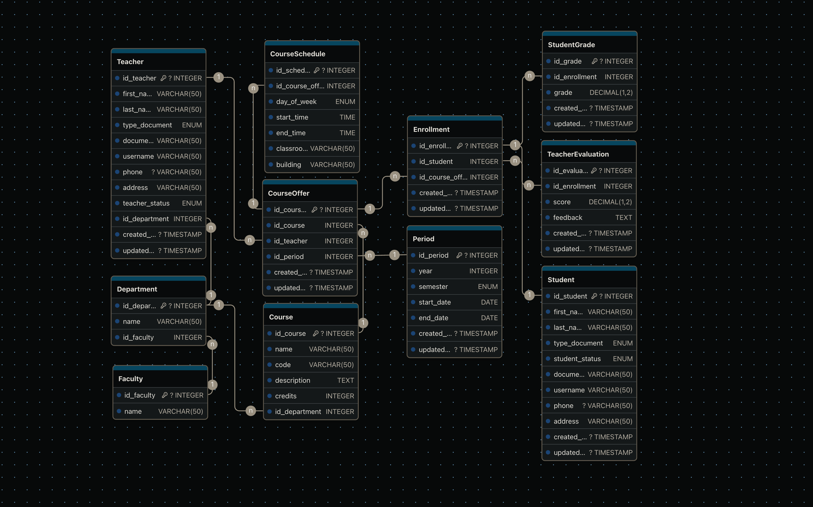

# 🗄️ Prueba SQL
La prueba SQL consiste en el diseño de una base de datos relacional para la Facultad de Ingeniería.

### 1️⃣ Clonar el repositorio
```sh
git clone https://github.com/ivantdev/convocatoriaUAPA.git
cd convocatoriaUAPA/sql
```

### 📂 Estructura de archivos SQL
- `sql/schema.sql` → Contiene el esquema de la base de datos.
- `sql/queries.sql` → Contiene las respuestas a las preguntas requeridas.
- `sql/diagram.png` → Imagen del diagrama de la base de datos.

### 📌 Diagrama de la base de datos


### 🛠️ Configuración de la base de datos (MariaDB o MySQL)
#### 📌 Crear la base de datos y cargar el esquema
```sh
mysql -u usuario -p < sql/schema.sql
```

#### 📌 Ejecutar las consultas
```sh
mysql -u usuario -p base_de_datos < sql/queries.sql
```
📌 **Nota:** La base de datos debe haber sido poblada previamente, alguans queries tienen datos brutos (como llaves foraneas), que pueden provocar errores.

### 📌 Preguntas resueltas en `sql/queries.sql`
1. ¿Cuántos docentes activos hay en la Facultad de Ingeniería?
2. ¿Cuáles son los cursos que se dictaron en un periodo dado?
3. ¿Cuál es la lista de estudiantes para un periodo actual?
4. ¿Cuál es el promedio de las calificaciones obtenidas en un curso los últimos 5 años?
5. ¿Cuál sería el procedimiento para crear un nuevo curso y asignarle un docente?

---

## 📌 Requisitos
### Para el Frontend
- [Node.js](https://nodejs.org/) versión 16 o superior.
- Gestor de paquetes `npm` o `yarn`.

### Para la Base de Datos
- [MariaDB](https://mariadb.org/) o [MySQL](https://www.mysql.com/).
